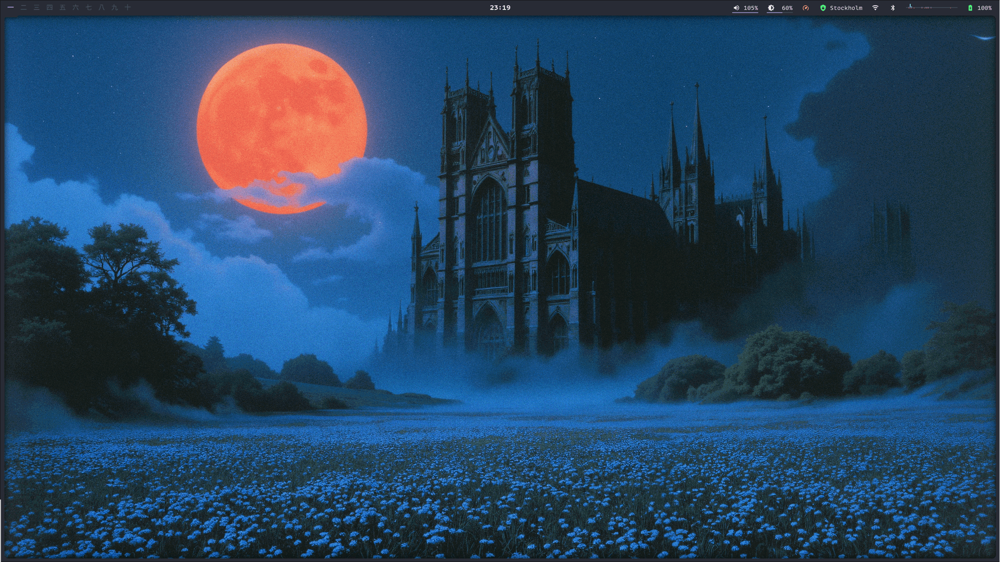
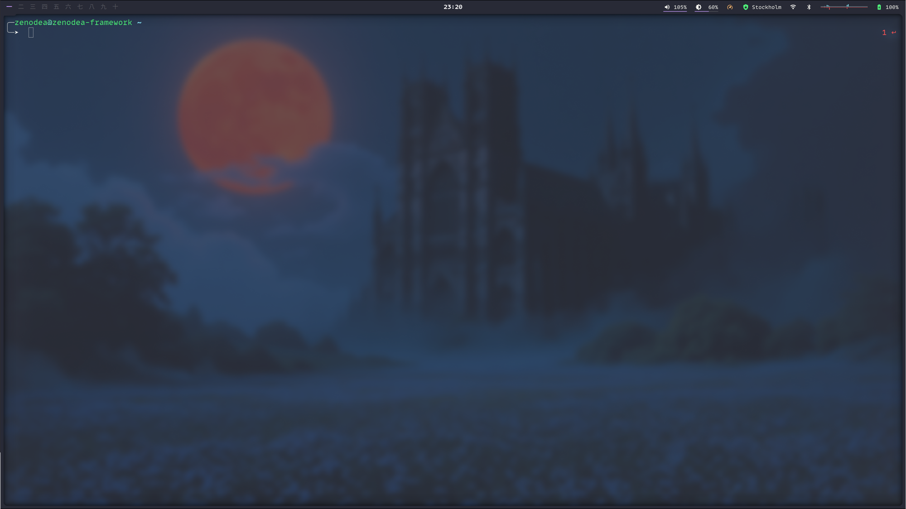
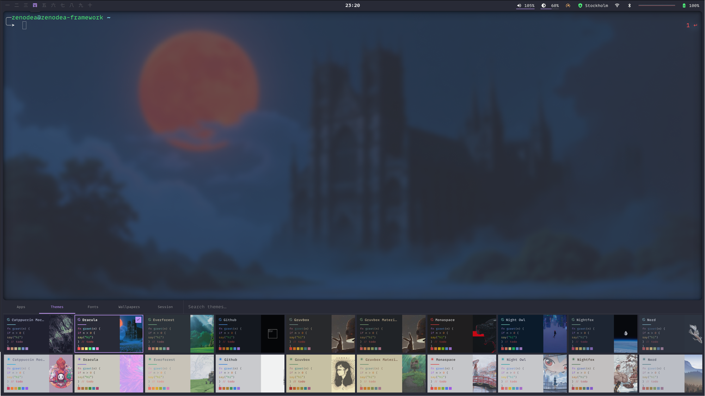
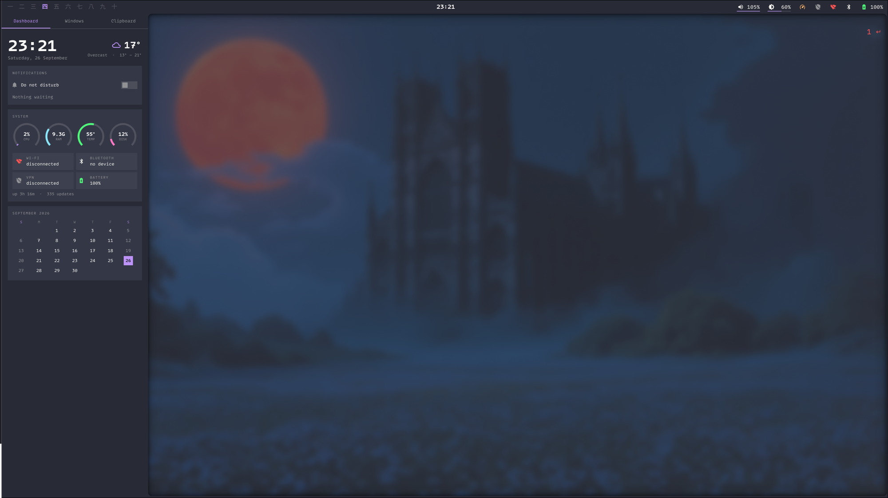
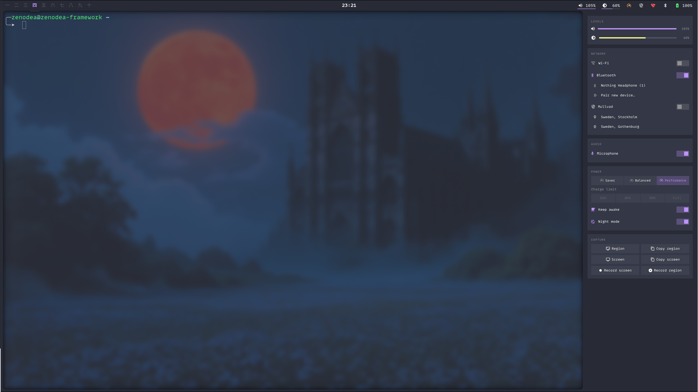
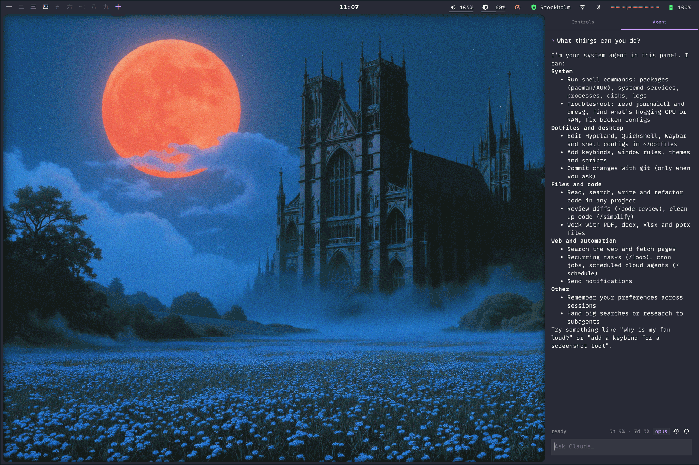
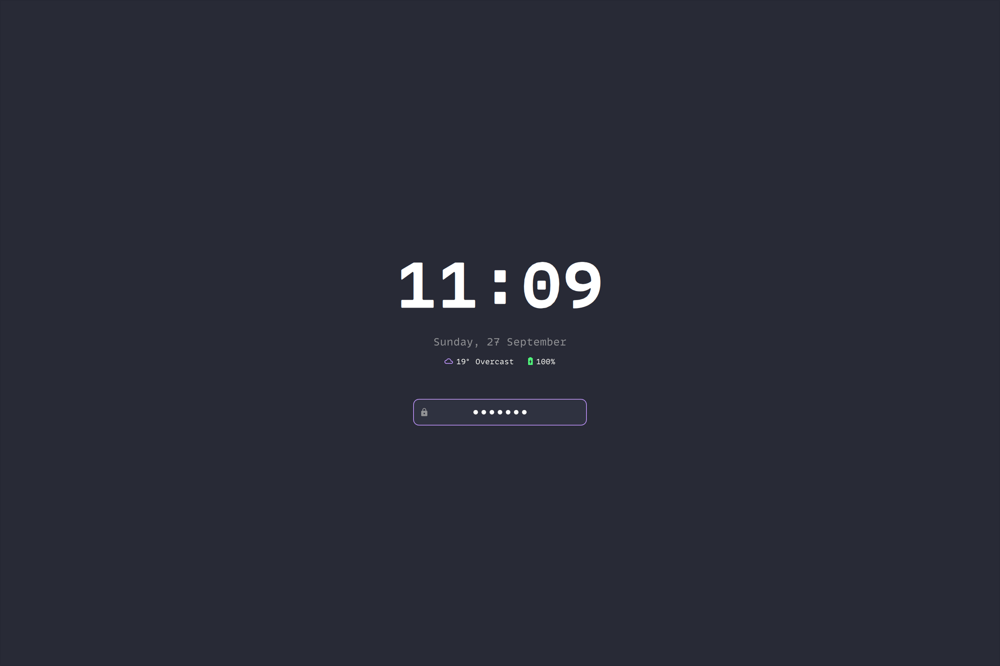

# dotfiles

My configs for Linux (Hyprland) and macOS (AeroSpace), with one theme system
that recolors everything at once.



<table>
  <tr>
    <td width="50%"><br><sub>Ghostty over the blurred wallpaper</sub></td>
    <td width="50%"><br><sub>Launcher, themes tab</sub></td>
  </tr>
  <tr>
    <td width="50%"><br><sub>Drawer: dashboard</sub></td>
    <td width="50%"><br><sub>Control centre</sub></td>
  </tr>
  <tr>
    <td width="50%"><br><sub>Control centre, agent tab</sub></td>
    <td width="50%"><br><sub>Lock screen</sub></td>
  </tr>
</table>

## Install

```sh
git clone --recurse-submodules https://github.com/zenodea/dotfiles_nixless ~/dotfiles
cd ~/dotfiles
bin/install-packages   # optional: Arch, Fedora, Debian or Homebrew
./install.sh
```

`install-packages` picks the script for your OS from `bin/packages/`. You can
also run one of those directly.

`install.sh` symlinks the configs and the `dotfiles` command, checks out the
wallpapers submodule if it's missing, and renders the current theme. Any file
it would replace gets moved to `<file>.bak` first.

## Layout

```
apps/<general|mac|linux>/<name>/
    app.sh        how to render and reload the app
    templates/    themed config templates
    config/       static config, symlinked to ~/.config/<name>

home/<general|mac|linux>/    mirrors $HOME (.zshrc, scripts/, …)
themes/<name>.sh             palettes
fonts/<name>.sh              mono fonts
fonts/text/<name>.sh         proportional fonts
bin/                         dotfiles, switch-theme, install-packages
lib/common.sh                helpers shared by bin/ and install.sh
lib/dotfiles/                the dotfiles command's subcommands
wallpapers/                  submodule: github.com/zenodea/wallpapers
screenshots/                 images for this README
```

`general/` is used on both systems, `mac/` and `linux/` only on their own.
Apps without an `app.sh` (lazygit, yazi, aerospace) are only symlinked. Apps
without a `config/` (ghostty, borders, fuzzel) are fully generated and written
straight to `~/.config`.

## Linux shell

The bar, launcher and panels are a [Quickshell](https://quickshell.org) config
in `apps/linux/quickshell/`. It replaced waybar and rofi. Both are still
installed and themed, and the `rofi-dotfiles` and `rofi-power` scripts in
`home/linux/scripts/` still work, but nothing starts them by default.

- **Frame**: bar along the top with workspaces, clock, volume, brightness,
  power profile, VPN, Wi-Fi, Bluetooth, media and battery. It hides for
  fullscreen windows.
- **Launcher** (bottom): apps, themes, fonts, wallpapers and a session page.
- **Drawer** (left): dashboard (clock, weather, notifications, system stats,
  calendar), window list, clipboard history.
- **Control centre** (right): volume, brightness, Wi-Fi, Bluetooth, Mullvad,
  mic, power profile, charge limit, keep awake, night mode, screenshots and
  screen recording.
- **Agent** (right, second tab): a Claude or Codex chat for the system, with
  saved sessions and tool approvals in the panel. `Ctrl P` attaches a
  screenshot, `Ctrl H` opens the session history (type to search, `Ctrl R`
  renames, `Ctrl D` deletes) and `Ctrl S` the settings: agent, model, effort,
  permissions, MCP servers and usage.
- **Lock screen**: the frame's sides close in over the desktop, then the clock,
  weather, battery and password field fade in. hypridle and the session page
  lock through it too.

| Key | |
|---|---|
| `Super Space` / `Super Q` | launcher |
| `Super T` / `Super F` / `Super W` | themes / fonts / wallpapers |
| `Super Shift P` | session |
| `Super D` | dashboard |
| `Super Tab` | windows |
| `Super Shift V` | clipboard |
| `Super C` | control centre |
| `Super A` | agent |
| `Super O` / `Super Shift L` | lock |

The shell reads its colors from a JSON file the theme switch writes, so it
recolors without restarting.

## Themes

```sh
dotfiles --theme <name>     # switch theme (tab-completes)
dotfiles --pick             # pick with fzf
dotfiles --random
dotfiles --list
dotfiles --current
```

Switching re-renders every app's config from its templates and reloads the
apps that are running.

Themed apps: hyprland, hyprlock, quickshell, waybar, fuzzel, rofi, gtk, vifm,
sketchybar, borders, Alfred, Raycast, ghostty, tmux, herdr, nvim, zed, Firefox,
Obsidian, and the wallpaper.

Themes (each has a `-light` version): catppuccin-mocha, dracula, everforest,
github, gruvbox, gruvbox-material, monaspace, nightfox, night-owl, nord,
rose-pine, sonokai, tokyo-night, zenbones.

## Fonts

```sh
dotfiles --font <name>          # mono font
dotfiles --text-font <name>     # proportional font
dotfiles --font                 # list mono fonts
dotfiles --text-font            # list text fonts
```

Fonts are separate from themes. The current choice is stored in
`.current-font` and reapplied on every theme switch. A font file looks like
this:

```sh
FONT_MONO_FAMILY="Berkeley Mono"        # ghostty, zed editor, code
FONT_TEXT_FAMILY="IBM Plex Sans Text"   # zed UI, Obsidian, sketchybar labels
FONT_SIZE="14"                          # optional, terminal size
FONT_CELL_HEIGHT="10%"                  # optional, ghostty line height
FONT_CELL_WIDTH="0%"                    # optional, ghostty cell width
```

The mono font goes to ghostty (and so everything in the terminal), zed's
editor, Obsidian code blocks and Firefox's `monospace`. The text font goes to
zed's UI, Obsidian, sketchybar labels, Firefox's UI and its `sans-serif`.
`--text-font` swaps only the text font. Sketchybar icons stay on SF Pro
because they're SF Symbols.

## Light / dark

```sh
dotfiles --auto on          # follow light/dark automatically
dotfiles --auto off
dotfiles --auto             # status
```

A theme counts as light or dark based on how bright its background is. That
also decides terminal opacity and zed's base theme. `gruvbox` is the dark
version and `gruvbox-light` the light one. `--auto on` follows whichever pair
the current theme belongs to.

To add a light version of a theme, add `themes/<name>-light.sh`. Nothing else
needs changing.

On macOS it follows the system appearance, so set Appearance to **Auto** in
System Settings. A launchd agent checks once a minute and only re-renders when
the mode changes. On Linux it goes by the clock: light from 07:00 to 19:00, set
by `DOTFILES_DAY_START` and `DOTFILES_DAY_END`, run by a systemd user timer.
`--auto on` installs the agent or timer and `--auto off` removes it.

If you pick a theme by hand while auto is on, your pick holds until the next
light/dark change. If that theme has a pair, auto switches to following it.

A light theme uses its dark version's `WALLPAPER` unless it sets its own.

`MUTED` (comments, placeholders, line numbers) is worked out from `FG` and
`BG`: it's the faintest color that still has 4.5:1 contrast against the
background. A theme can set `MUTED=` to use its own color instead.

Auto mode never changes the macOS system appearance, because setting Light or
Dark by hand turns macOS's Auto off.

### Adding an app

Make `apps/<general|mac|linux>/<name>/` with an `app.sh`:

```sh
render() {                          # paths are relative to this app's dir
    generate config "$HOME/.config/ghostty/config"
}

reload() {                          # optional
    pgrep -x ghostty > /dev/null 2>&1 || return 0
    pkill -SIGUSR2 ghostty
    note "reloaded"
}
```

`generate <template> <dest>` reads from the app's `templates/`. `<dest>` is
either an absolute path or a path inside the app dir (like `config/…`) for
files that get symlinked. A `general/` app that reloads differently on each OS
can define `reload_mac` and `reload_linux`.

`switch-theme` runs each `app.sh` in its own subshell with the palette exported
(`$BG`, `$ACCENT`, `$ACCENT_RGB`, `$THEME_APPEARANCE`, …) and the helpers
`generate`, `copy`, `note`, `skip` and `have`. An app can have only a `reload`
(like `mac/appearance` or `linux/gtk`). If one app fails, it's reported and the
rest still run. `--no-reload` renders without reloading anything.

## Other commands

```sh
dotfiles --wallpaper <name|random>   # change the wallpaper only
dotfiles --update                    # git pull, then reapply the theme
dotfiles --doctor                    # check symlinks, dependencies, drift
dotfiles --save [msg]                # add, commit, push
dotfiles --sync                      # re-run install.sh
```

## Other apps

- **tmux**: themed config plus git, popup and sessionizer scripts.
- **herdr**: tmux-style keys (`ctrl+a` prefix), themed tab bar, git and sessionizer scripts.
- **pi**: `apps/general/pi/` links extensions into `~/.pi/agent/extensions`
  and adds the packages in `packages.txt` to its settings.
- **Raycast** (macOS): `apps/mac/raycast/extension/` is a Raycast extension for
  the `dotfiles` command: search themes and fonts, set wallpapers, random
  theme, toggle auto, maintenance. See its own README for development.
- **Alfred** (macOS): `apps/mac/alfred/workflows/dotfiles/` is a workflow for
  the same command. `install.sh` symlinks it into Alfred, so edits in the repo
  apply right away. Restart Alfred once after the first install. Type
  `dotfiles`, then:

  | | |
  |---|---|
  | `theme <name>` | switch theme (⇥ to browse) |
  | `wallpaper <name>` | wallpaper only, `random` works |
  | `random` | random theme |
  | `update` / `sync` / `doctor` | output shown in Large Type |
  | `save` | commit and push |

## Notes

- After switching themes on one machine, run `dotfiles --update` on the other.
- Raycast needs Pro, and you have to press ⏎ once in its popup to apply a
  theme.
- Rendered configs are gitignored. Only palettes, templates and
  `.current-theme` are tracked, so a fresh clone has to run `install.sh`.
- `.auto-theme` is tracked so both machines follow the same pair, and
  `install.sh` puts the agent or timer back. The manual-pick pin is local only.
- Auto mode rewrites `.current-theme` twice a day, so the repo shows as
  changed. `--doctor` reports it and `--save` commits it.
